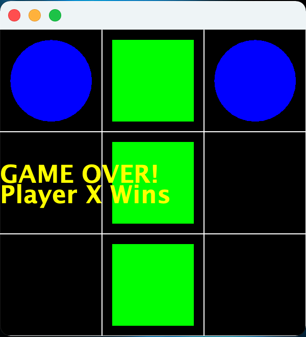
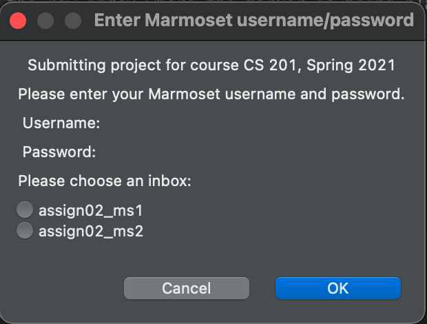

**Milestone 1 Due:** Tuesday, Mar 2nd by 11:59 PM

**Milestone 2 Due:** Wednesday, Mar 10th by 11:59 PM

## Getting Started

Download [CS201\_Assign02\_Gradle.zip](CS201_Assign02_Gradle.zip) Extract the zip file and import it into Eclipse

> **File&rarr;Import...&rarr;Gradle&rarr;Existing Gradle Project**

You should see a project called **CS201\_Assign02\_Gradle** in the Package Explorer window.

## Your Task

In this assignment, you will complete the implementation of a Tic-Tac-Toe program that includes a GUI and the ability to load/save games. There will be two milestones:

-   Milestone 1: Implement the **TicTacToeModel** class methods (except for saving and loading games) and the **TicTacToeController** class. This will allow you to play the game in the console via **TicTacToeConsole**.

-   Milestone 2: Implement the **TicTacToeModel** save and load methods to allow for the current game to be saved or a previously saved game to be loaded from a file. Also complete the **TicTacToePanel** class which will provide a GUI interface for the game that can then be played via **TicTacToeGUI**.

Note that the bodies of some of the methods have the code


throw new UnsupportedOperationException("not implemented yet");


As you implement each method, simply remove this code.

### TicTacToeModel class

An instance of the **TicTacToeModel** class will store an **int** representing which player's turn it is, and a representation of the board as a 3x3 array of **int**s. Each element of the array will contain one of three values

-   0 - blank (empty) cell
-   **PLAYER_X** - if the cell contains an X
-   **PLAYER_O** - if the cell contains an O

Use the **PLAYER_X** and **PLAYER_O** constants defined in the model class, **NOT** the values 1 or 2. 

To allocate a 3x3 array of **int** values:


int[][] board = new int[3][3];


Note that each element of the array will contain the value 0 initially.

The first dimension of the array is the rows of the board, and the second dimension is the columns.  Each array element represents a location on the game board.

For the model class, you must implement the following game logic methods:

#### Milestone 1

* Constructor which initializes the board array and starts the game with **PLAYER_X**

* **public int[][] getBoard(int[][] board)** - This method should return the array representing the board.

* **public boolean isLegalMove(int player, int row, int col)** - A legal move is one in which the specified row and column are each in the range 0-2 (inclusive), along with the board containing a blank space (0 value) at that position and it is the players turn.  The method should return **true** if the move is legal, and **false** if the move is not legal.

* **public void placeMarker(int row, int col)** - This method should place the current player's marker on the board at the specified row and column. *You may assume that this method is called only for legal moves.*

* **public void updateTurn()** - This method should switch the current player.

* **public boolean playerWins()** - This method should return **true** if the current player has won the game by getting three pieces in a row in a row, column, or diagonal, and **false** if the current player has not won the game.

* **public boolean isDraw()** - This method should return **true** if all spaces on the board are occupied and **false** if there is at least one empty space on the board.

#### Milestone 2

* **public boolean readBoard()** - This method should read from the provided **saveGame** filename to set the elements of the board array by reading one integer at a time from the file. The method should return **true** if the board is loaded successfully and **false** otherwise. It **must not** throw any exceptions, but must handle them within the method printing an appropriate message for whatever problem has occurred.

* **public boolean writeBoard()** - This method should save the current board to the **saveGame** filename. It should write each array element consecutively to the file. The method should return **true** if the board is saved successfully and **false** otherwise. It **must not** throw any exceptions, but must handle them within the method printing an appropriate message for whatever problem has occurred.

### TicTacToeController class

An instance of the **TicTacToeController** class will implement methods that take a **TicTacToeModel** object along with other parameters as needed to call the corresponding model class game logic methods. These include:

* **public boolean checkMove(TicTacToeModel model, int player, int row, int col)** - This method should return true if the move is legal for the given player and false otherwise. *Hint:* Consider using the **isLegalMove()** method of the model object parameter.
 
* **public boolean checkWin(TicTacToeModel model)** - This method should return true if the current player has a winning configuration on the board. *Hint:* Consider using the **playerWins()** method of the model object parameter.

* **public boolean checkDraw(TicTacToeModel model)** - This method should return true if the current board has a draw configuration. *Hint:* Consider using the **isDraw()** method of the model object parameter.

* **public void updateBoard(TicTacToeModel model, int row, int col)** - This method should update the board with the current player's marker. *Hint:* Consider using the **placeMarker()** method of the model object parameter.

* **public void changePlayer()** - This method should swap the current player. *Hint:* Consider using the **updateTurn()** method of the model object parameter.

### TicTacToePanel class

An instance of the **TicTacToePanel** class will implement event driven methods for a GUI version of tic-tac-toe. It will use the same model and controller classes as the console version, but obtain user input via mouse and keyboard events. These include:

* **private void handleMouseClick(MouseEvent e)** - This method will process a mouse click to determine which cell a player is attempting to place a marker in. If the *left* mouse button is clicked (i.e. **MouseEvent.BUTTON1**), then **PLAYER_X** is attempting to place a marker. If the *right* mouse button is clicked (i.e. **MouseEvent.BUTTON3**), then **PLAYER_O** is attempting to place a marker. You will need to convert the screen coordinates to corresponding row/column indicies for the model before calling appropriate controller methods to determine if the attempted move is legal, and if so placing the marker, checking for a win condition, and switching the player if there is not a winning configuration. Additionally, you will need to check for a draw condition if there is not a winning configuration. *Hint:* Don't forget to refresh the window via **repaint()**.

* **private void handleKeyTyped(KeyEvent e)** - This method will process key presses and should attempt to *save* the current game state if the 's' key is typed, or *load* the previous saved game if the 'l' key is typed. The method should print messages to the console indicating success/failure of these operations. *Hint:* Don't forget to refresh the window via **repaint()** if a previous game was successfully loaded.

* **public paint(Graphics g)** - This method should render the current board using *green squares* for **X** and *blue circles* for **O**. It should also render text once a win or draw state has occurred. Code has been provided to draw the grid lines. 

Note that the default board is 300x300 such that each cell is 100x100 pixels on the screen.

## Example Console Session

Run the program by right-clicking on the file **TicTacToeConsole.java** in the **src/main/java/(default package)** package, and then choosing

> **Run As&rarr;Java Application**

Here is an example session (user input in **bold**):

<pre>
   |   |   
---|---|---
   |   |   
---|---|---
   |   |   

Player X's turn:
Enter row and column (0-2): <b>1</b> <b>1</b>

   |   |   
---|---|---
   | X |   
---|---|---
   |   |   

Player O's turn:
Enter row and column (0-2): <b>0</b> <b>0</b>

 O |   |   
---|---|---
   | X |   
---|---|---
   |   |   

Player X's turn:
Enter row and column (0-2): <b>4</b> <b>2</b>
Invalid move, try again

 O |   |   
---|---|---
   | X |   
---|---|---
   |   |   

Player X's turn:
Enter row and column (0-2): <b>0</b> <b>0</b> 
Invalid move, try again

 O |   |   
---|---|---
   | X |   
---|---|---
   |   |   

Player X's turn:
Enter row and column (0-2): <b>0</b>  <b>1</b>

 O | X |   
---|---|---
   | X |   
---|---|---
   |   |   

Player O's turn:
Enter row and column (0-2): <b>0</b> <b>2</b>

 O | X | O  
---|---|---
   | X |   
---|---|---
   |   |   

Player X's turn:
Enter row and column (0-2): <b>2</b> <b>1</b>

 O | X | O  
---|---|---
   | X |   
---|---|---
   | X |   
   
GAME OVER!
Player X wins!
Thanks for playing!
</pre>

## Example GUI

Here is an example screenshot for the GUI

> 

## Testing

In **src/test/java/(default package)** right-click on **TicTacToeTest.java** and choose **Run As...&rarr;JUnit Test**. This will run the JUnit tests for the **TicTacToeModel** class. If you have correctly implemented the **TicTacToeModel** class, you will see a green bar, indicating that all tests have succeeded. Note that it is important to get the constructor correct, otherwise the tests will likely fail even if the other methods are implemented correctly.

It is possible that the tests don't test every possible situation. You may wish to add your own tests!

## Grading

**Milestone 1:**

* **TicTacToeModel** class - 70%
    * Constructor - 5% 
    * getBoard - 5%
    * isLegalMove - 10%
    * placeMarker - 10%
    * updateTurn - 10%
    * playerWins - 15% 
    * isDraw - 15%
* **TicTacToeController** class - 30%
    * checkMove - 6% 
    * checkWin - 6%
    * checkDraw - 6%
    * updateBoard - 6%
    * changePlayer - 6%

**Milestone 2:**

* **TicTacToeModel** class - 30%
    * readBoard - 15% 
    * writeBoard - 15%

* **TicTacToePanel** class - 70%
    * handleMouseClick
        * calculate board indices - 10%
        * determine player - 5%
        * check win - 5%
        * check draw - 5%
        * switch player - 5%
        * refresh window - 5%
    * handleKeyTyped
        * save game - 5%
        * load game - 5%
        * refresh window - 5%
    * paint
        * draw game state - 10%
        * draw win message - 5%
        * draw draw message - 5%

For both milestones, points may be deducted for poor coding style, including:

* Inconsistent indentation
* Cryptic variable names
* Non-private instance fields
* Initialization of fields outside the constructor
* Lack of comments

## Submitting

When you are done with each milestone, submit the project to the Marmoset server using the SimpleMarmosetUploader Eclipse plugin.

### From Eclipse

Use the [Simple Marmoset Uploader Plugin](../resources.html), by selecting the project (**CS201\_Assign01\_Gradle**) in the package explorer and then clicking the blue up arrow button in the toolbar (or right click and choose **Submit project...**). Enter your Marmoset username and password when prompted.  Make sure your choose **assign02\_ms1** or **assign02\_ms2** as the inbox:

> 

### After you submit

**Very important**: After you submit the assignment, please log into the [Marmoset server](https://cs.ycp.edu/marmoset) and check the files you submitted to make sure that they are correct.

*It is your responsibility to make sure that you have submitted your work correctly.*

## An Agile Approach to Developing the Tic-Tac-Toe Game Assignment

Just like for the previous assignment, it will be *extremely* beneficial to tackle this one again with an agile approach. Consider working on one task at a time and frequently running/testing your code.

