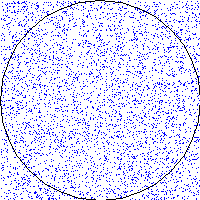

Getting Started
===============

## Getting Started

Download [CS201\_Lab18\_Gradle.zip](CS201_Lab18_Gradle.zip). Extract the zip file and import it into Eclipse

> **File&rarr;Import...&rarr;Gradle&rarr;Existing Gradle Project**

You should see a project called **CS201\_Lab18\_Gradle** in the Package Explorer window.

## Estimating π

An approximation of π can be computed by generating random points in a square of some arbitrary size centered at the origin of the x/y plane. Each time one of the random points falls within a circle centered at the origin (where the circle completely fills the square), increase a counter. After some number of random points have been generated, divide the counter (how many random points were within the circle) by the total number of random points. This number will approximate the area of a circle of radius 0.5. We know that for a circle, the area *a* is computed by the equation

> *a* = π*r*2

Letting *r* equal 0.5, and re-arranging to solve for π,

> π = *a* / .25

For example, here is a picture showing 5000 random points within a 200 by 200 square centered at the origin, along with an outline of a circle within the square:

> 

Based on these 5000 points, we estimate π to be 3.0936. This is obviously not very accurate: computing more random points would lead to a more accurate estimate.

## Your Task

Your task is to use the technique described above to estimate π using 100,000,000 (one hundred million) random points.

Your program should support two computation techniques:

-   purely sequential computation (using a single thread)
-   parallel computation using 2 threads

Your program should measure the number of milliseconds needed to estimate π using both techniques. Is the parallel version faster? If so, how much faster?

## Hints

Create instances of the **PiTask** class to perform the computation (or part of the computation in the parallel version). You will need to implement the **run** method of this class so that generates random points and counts how many fall within the circle.

In the sequential computation, create one **PiTask** object and have it compute all 100,000,000 random points.

In the parallel computation, create two **PiTask** objects and have each compute 50,000,000 points. The total number of points that fell within the circle will thus be the sum of the counts computed by each of the two tasks.

## Running the Program

Run the program by right-clicking on the file **Benchmark.java** in the **src/main/java/(default package)** package, and then choosing

> **Run As&rarr;Java Application**

## Submitting

When you are done, submit the lab to the Marmoset server using either of the methods below.

### From Eclipse

If you have the [Simple Marmoset Uploader Plugin](../resources/index.html) installed, then right click on the project (**CS201\_Lab18\_Gradle**) and choose **Submit project...**. Enter your Marmoset username and password when prompted.

### From a web browser

Save the project (**CS201\_Lab18\_Gradle**) to a zip file by right-clicking it and choosing

> **Export...&rarr;Archive File**

Upload the saved zip file to the Marmoset server as **lab18**. The server URL is

> [https://cs.ycp.edu/marmoset/](https://cs.ycp.edu/marmoset/)