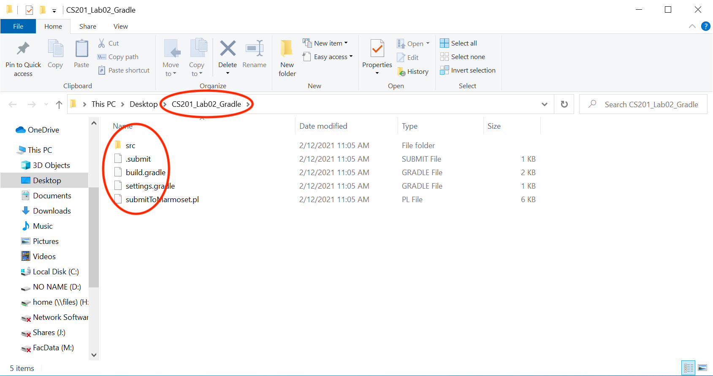
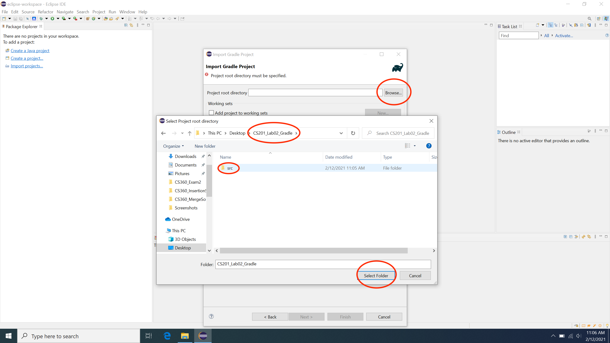
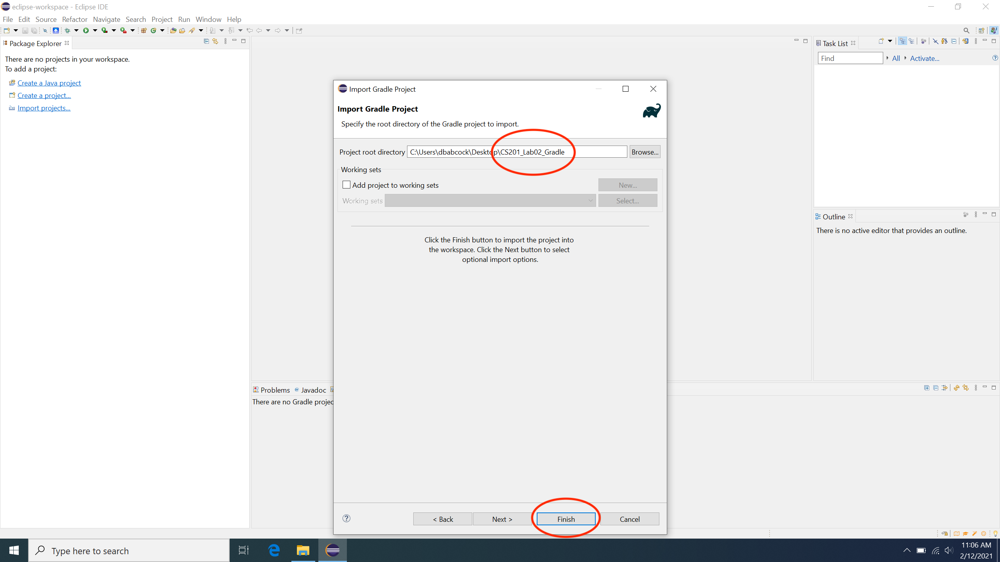
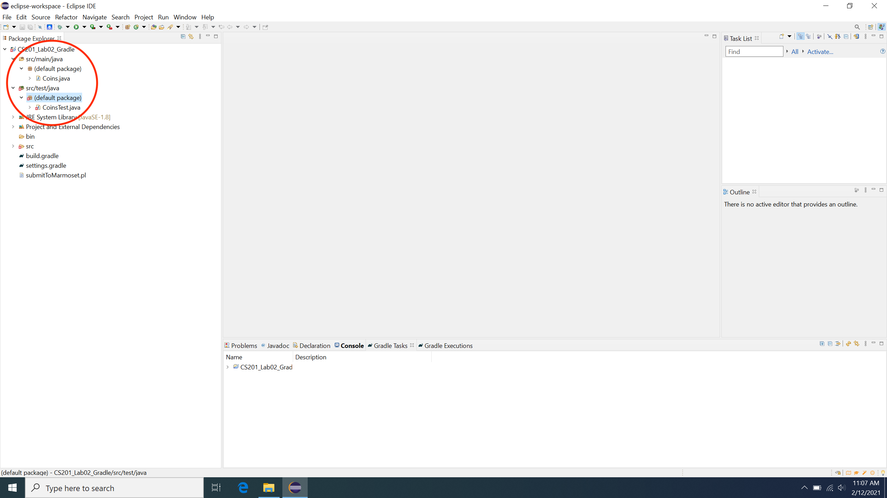
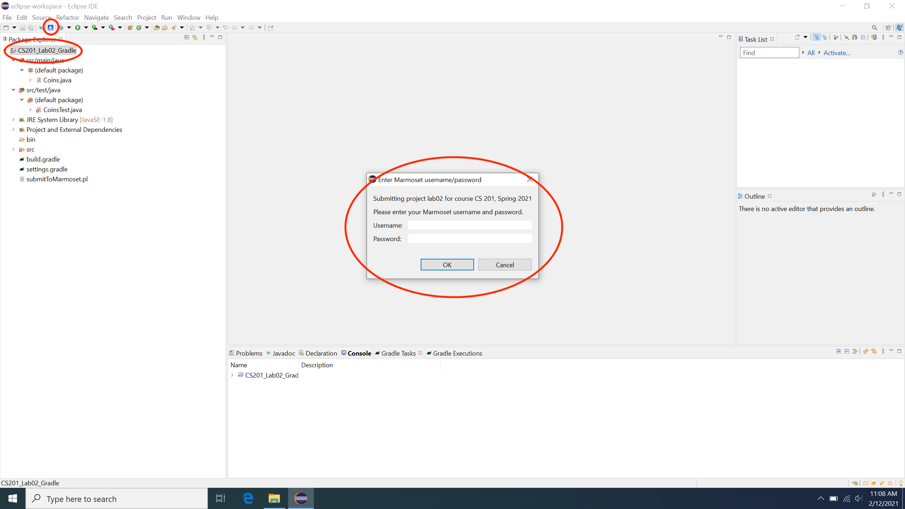

This page will provide detailed instructions for properly importing the course Gradle projects into Eclipse and submitting them to the Marmoset server using the [SimpleMarmosetUploader](index.html) Eclipse plugin.

## Importing Gradle Projects into Eclipse

Download the desired project zip file from the [course webpage](../index.html) Extract the zip file into a directory with the same name as the zip file such that it contains the **src** subdirectory and a few configuration files. For example, for the project [CS201\_Lab02\_Gradle.zip](../labs/CS201_Lab02_Gradle.zip) should look similar to

> 

Then import it into Eclipse by selecting

> **File&rarr;Import...&rarr;Gradle&rarr;Existing Gradle Project**

Select **Browse** in the **Import Gradle Project** window and navigate to the extracted folder from above such that you see the **src** directory. Then choose **Select Folder** as shown below

> 

Once the proper directory has been selected, choose **Finish** to import the project as shown

> 

If the import was successful, you should see a project in the **Package Explorer** pane (e.g. **CS201\_Lab02\_Gradle**). If you do not see the **Package Explorer** pane, select **Window&rarr;Show View&rarr;Package Explorer** to open the pane. Expanding the project tab should contain a **src/main/java** for the source files and **src/main/test** tab for the test files as shown

> 

If you do not see this structure, try selecting the top level tab (e.g. **CS201\_Lab02\_Gradle**), then right-click and select **Delete**. Then reimport the project.

## Submitting to Marmoset via the SimpleMarmosetUploader

Once you have the [SimpleMarmosetUploader](index.html) Eclipse plugin installed, 

<b>BE SURE TO SAVE ALL YOUR FILES BEFORE SUBMITTING!</b> In Eclipse, select <b>File&rarr;Save All</b>

Then to submit a project, simply select the top level tab (e.g. **CS201\_Lab02\_Gradle**) then click the blue plugin icon in the button bar. This should open a dialog box for you to enter your credentials as shown

> 

After entering your credentials, you should see a message that the project was successfully submitted.

