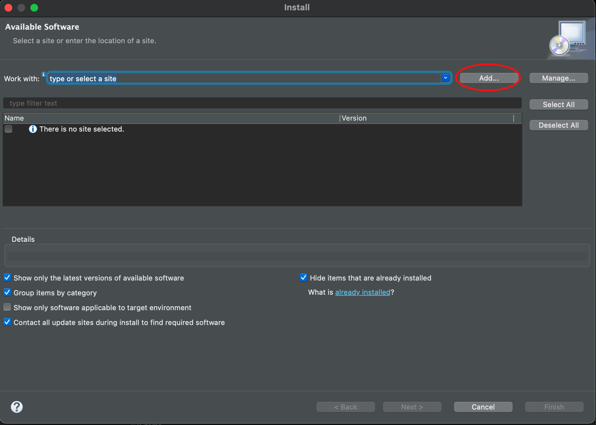
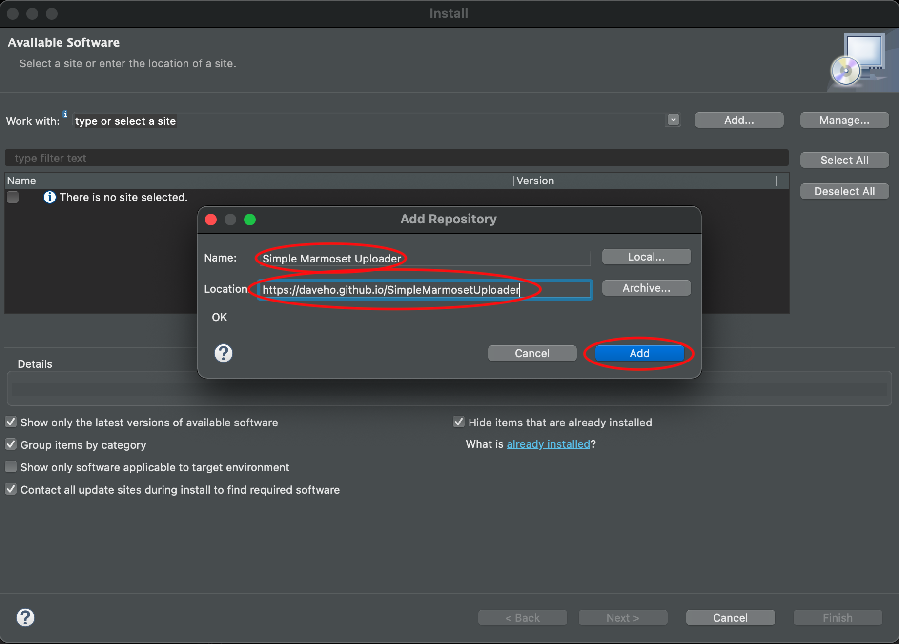
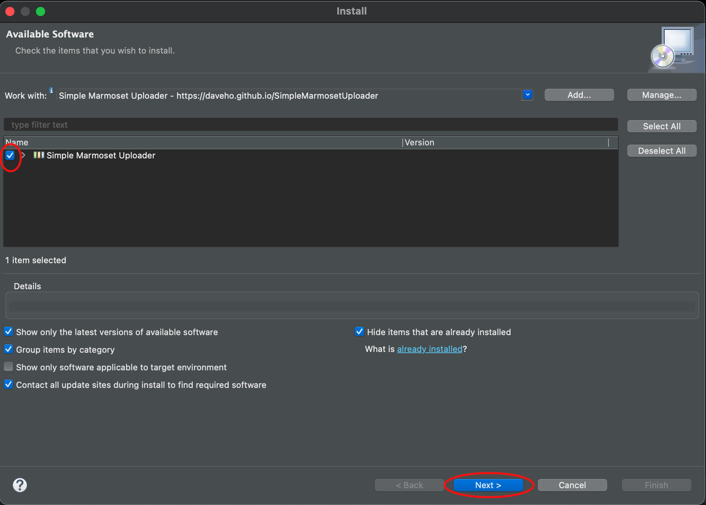
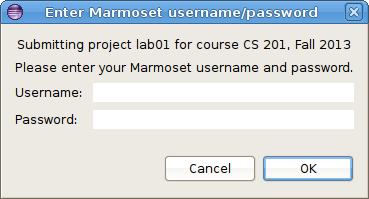
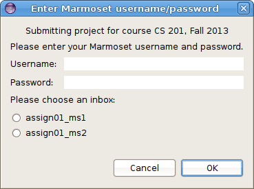
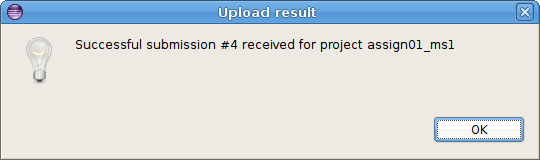

This page has links to useful resources for the course.

Java and Eclipse
================

All of the software we are using is open source (free). I encourage you to download it to install on your own computer.

-   [Java Development Kit](https://www.oracle.com/java/technologies/javase-downloads.html): This is required to run Java programs. Make sure you download the JDK appropriate for your operating system, e.g. **macOS Installer** or **Windows x64 Installer**.
-   [Eclipse IDE](http://www.eclipse.org/downloads/): This is the Java development environment we are using in class. It has a number of variants. You should get the **Eclipse IDE for Java Developers**.

SimpleMarmosetUploader plugin
=============================

Once you have Eclipse installed, you can install the SimpleMarmosetUploader plugin to allow you to submit projects directly from Eclipse.

Please be aware that the plugin is somewhat experimental. [Let me know](mailto:dbabcock@ycp.edu) if you encounter any problems using it.

Installing the plugin
---------------------

Choose **Help** → **Install New Software...**.

Click the **Add...** button

> 

In the **Name:** field, enter **Simple Marmoset Uploader**.

In the **Location:** field, paste the following URL:

> https://daveho.github.io/SimpleMarmosetUploader

Click **Add**.

> 

In the **Install** dialog, click on **Simple Marmoset Uploader**.

The dialog should now look something like this (click for full size):

> 

Click **Next** twice. When prompted, accept the license agreement, then click **Finish**.

When you see the warning about software that contains unsigned content, click **Install anyway**.

When prompted, click **Restart Now** to restart Eclipse. The plugin should now be available.

Using the plugin
----------------

When you are ready to submit a project (lab or assignment), there are two ways.

1.  Select the project in the package explorer and then press the blue up arrow button in the toolbar:

    > 

2.  Right click on the project and choose **Submit project...**.

If the project has been enabled for submission within Eclipse, you will see a dialog that looks something like the following:

> 

Note: if the project has multiple milestones, the dialog might look like this:

> 

If there are multiple inboxes, you will need to select one.

Enter your Marmoset username and password and click **OK**. If the submission is successful, you will see a dialog that looks something like this:

> 

**Important**: you should still log into the submission server using a web browser to verify that your files were received successfully.
